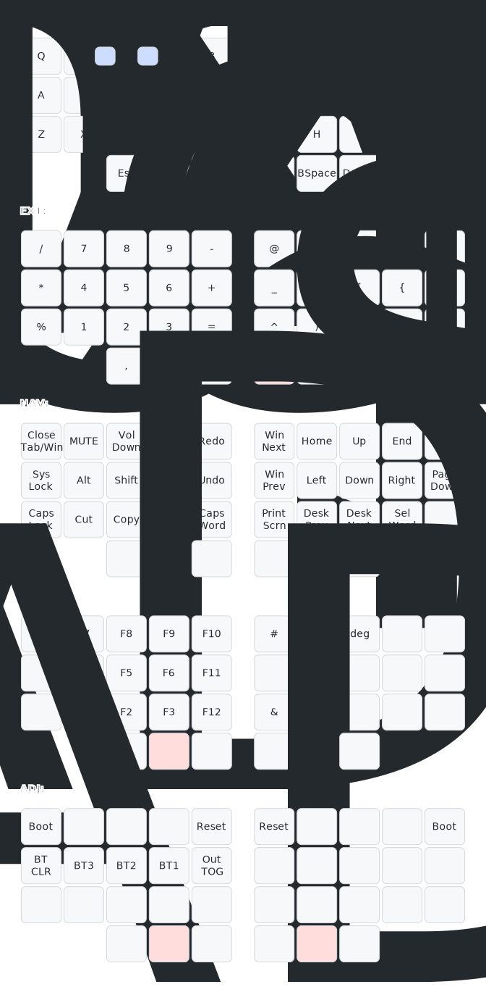

# zmk-config

This is a [ZMK](https://zmk.dev) config repo for my 36-keys Chocofi keyboard,
arranged in 3 rows and 5 columns with 3 thumb keys on each side, using
Colemak-DH.

It uses:

- Combos on the default `DEF` layer are dead key modifiers, to be used to easily
produce Italian accented letters using the `US-Intl with AltGr Dead Keys`
layout
- Home Row Mods and Layer taps on the `DEF` layer
- Tap dance on the `EXT` layer for less common symbols
- Tap dance on the <kbd>Close Tab/Win</kbd> key in the `NAV` layer to close
  tabs or application.
- Shortcuts and combos for easier OS navigation in the `NAV` layer.
- `ADJ` layer is implemented as a tri-layer (active when both `NAV` and `FUN` are active).

## Reference layout

(Visualization generated with [@caksoylar/keymap](https://github.com/caksoylar/keymap))
