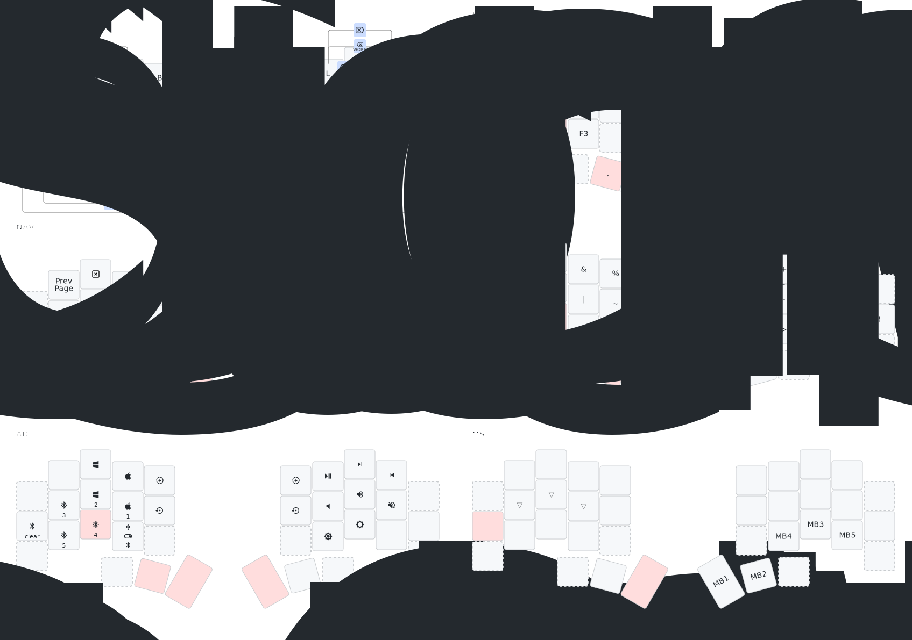

# zmk-config

> **Warning**
> The 30-keys version of this keymap is still under development. As a
> consequence, the README hereafter is not updated. While some information here
> might still hold true, please refer to the keymap file itself (or to the
> image below) for more details.

> **Note**
> The drawing at the end of this page is automatically updated at each commit
> via a Github actions workflow. You can refer to that to get a sense of the
> keymap I'm currently using. Some glyphs may not make sense to you, please
> refer to the keymap file and drawing config file in such case.

This is a [ZMK](https://zmk.dev) config repo for my 34/36-keys Chocofi keyboard,
arranged in 3 rows and 5 columns with 3 thumb keys on each side, using
the Canary layout.

The configuration is heavily inspired (although simplyfied) by [Urob](https://github.com/urob/zmk-config)'s keymap.

Some highlights:

- Urob's [timeless
  HRMs](https://github.com/urob/zmk-config#timeless-homerow-mods) configuration
 is used. `CTRL` and `GUI` are swapped in the OSX base layer to favor muscle
 memory across different operating systems
- The `BASE` and `NAV` layers are duplicated to work with both Windows and
  MacOS (the macros on the ADJ layer both change the bluetooth profile and the
  toggle the correct base layer)
- The most commonly used shortcuts (e.g., copy and paste) are implemented as combos on
  the right hand side of the base layers to ease one-handed use while using the
  mouse
- Parenthesis are combos on the `BASE` layer. The other symbols are vertical
  combos on the same layer (logically linked symbols are on the same column,
  e.g. `+` and `-` or `&` and `|`)
- Combos are also defined to open and close parenthesis and put the cursor in
  between them
- The combo on the left pinky and middle finger home row keys is a dead key
  modifier, to be used to easily
produce Italian accented letters using the `US-Intl with AltGr Dead Keys`
- Symbols on the `BASE` layer are mod-morphed with shift to produce more
  intuitive results.
- Over-powered thumb keys:
  - `Shift + Space` outputs `. + Space` and activates Shift for the next
    keytap. Quick roll on the two inner thumb keys to quickly end a sentence and
    start a new one
  - Double-tapping `Sticky Shift` enables `Caps Word`.
  - `Backspace` morphs into `Delete`
- The layout basically relies on 34 keys only (one could easily get rid of the
  outer thumb keys) and could also be reduced to 30 keys (the upper keys on the
  outer columns and the bottom ones on the inner columns are only used on the
  base layers)

## Reference layout

(Visualization generated with [@caksoylar/keymap](https://github.com/caksoylar/keymap-drawer))
